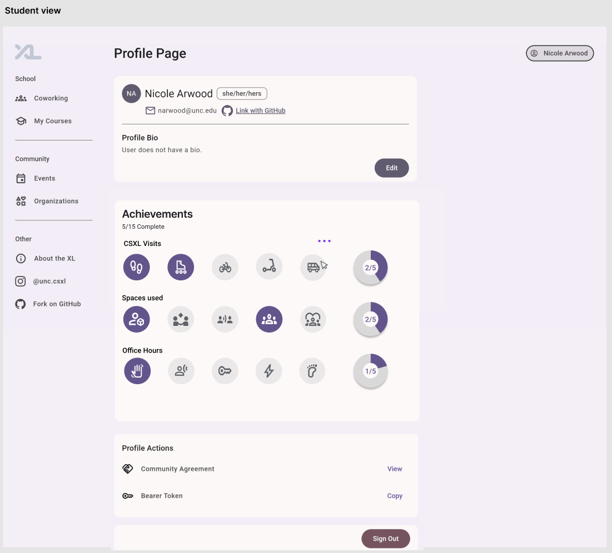
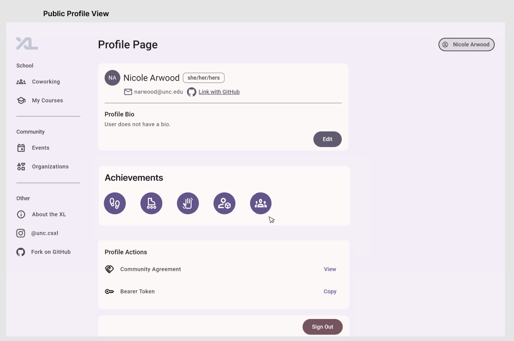

# User Achievements System
By Benjamin Hadad, Eldar Utiushev, Nicole Arwood, and Suzanna Moran

## Overview
This feature allows users to gain achievements after completing various tasks. Some example achievements are booking an office hours session or coworking space for the first time, or visiting the CSXL 25 times. This will have a few key use cases. It will motivate students to explore the various offerings available through CSXL, allow those who have made good use of those offerings to showcase that fact to others, and allow professors and administrators to monitor student usage of CSXL resources by viewing a student's public profile (using CSXL achievements as a proxy for CSXL resource usage by a given student).

### Key Personas
- John, a student, wants to be able to earn and track achievements so that he can showcase his effort to others.
- Jane, an administrator, wants to add and track achievements so that there can be new ways for students to demonstrate key milestones.
- Alice, a professor, wants to view achievements of students so that she can monitor how they are using the resources available to them.

### User Stories
##### John
- I will be able to view the achievements I have already earned and have yet to earn through my profile page. As I conduct activities than gain an achievement, I want to gain the achievement in question automatically, without any need for manual intervention by me or anyone else. 
- All of these actions are of high frequency and importance, since students will be the primary users of the leaderboard feature, and a technical issue in the process may cause a student to stop using the leaderboard feature or even the website as a whole.
- Possible stretch goal: If I go to the achievements page and click on a link from there, I should be able to view a leaderboard of others' achievements.
##### Jane
- I should be able to make small updates to the code in order to add achievements, without any large changes. The new achievements should be applied automatically and retroactively. I should also be able to track achievements using the achievements leaderboard (using the method discussed in the aforementioned story above) in order to make sure that new achievements are working as intended.
- Making the updates is of low frequency but very high importance. It is low-frequency because adding a new achievement is not likely to occur very often, but it is very important because a problem with that process could potentially result in difficulties impacting all users of the website. 
- The subsequent process of tracking achievements in order to make sure it is working properly is of medium frequency and medium importance. While more frequent than the actual update itself, it is still not an especially common scenario. When that scenario does take place, it is of moderate importance, since it could help catch an issue sooner, but hopefully the code for a given achievement should already be well-tested prior to reaching production.
##### Alice
- I should be able to check the achievement status of a given individual. This functionality should likely be available through the aforementioned leaderboard feature, perhaps as a filter functionality of a table. Specifically, this would involve clicking on the achievements page, navigating to the leaderboard sub-page, and then conducting a search from there.
- This is of moderate frequency and moderate importance. It is not as common as the aforementioned student use (since there are almost certainly far more student users than staff users), but it is still a reasonable scenario to consider. An issue with this user story could certainly cause problems, but professors are likely to be more patient than the average student, meaning that there is less of a risk that an issue could create a bad immediate impression and cause a professor to stop using CSXL resources entirely.

### Wireframes
Private user profile achievements view (applies to John):

Public user profile achievements view (applies to all three aforementioned personas):

### Technical Implementation Opportunities and Planning
This will be interacting with the following areas of the existing code base:
- The profile view and public profile view frontend
- The SQL tables for the different data used in order to determine achievement eligibility
- The entity and model for the user, as well as the public user model
- The entry point file (where AchievementsService.begin is called, starting the repeated achievement check loop)
- The user service

The achievements view on the profile page will be a card and some associated icons representing achievements. Additionally, displaying the achievement notifications will likely require displaying a dialog, alert, or equivalent component. No other components or widgets are expected to be needed for the basic project. However, upon adding the admin functionality stretch goals, additional components will likely be involved.

A new model called Achievement will be added. The user and public user models will have a field called achievements that consists of a list of relevant achievements. For the user model, this will include all possible achievements, regardless of whether or not they have been earned, while, for the public user model, the achievements field will only contain achievements that have been earned by a given user. Upon adding the admin functionality stretch goals, additional models are likely to be needed, and the specific details of that will be decided once debugging is complete for the initial, basic implementation.
	
At this time, no actual changes to the API files are likely to be needed. However, changes to the model files and service files will be involved (as discussed above), and that will, in turn, result in changes to the APIs. Specifically, the APIs will now provide an array of achievements as part of the user profile data, both for private viewing of one’s own profile and public viewing of someone else’s profile.
	
There are two key concerns. First off, students should only be able to earn achievements for themselves, and those achievements must be based on actually completing the tasks in question. In other words, there should be no way for students to “trick” the system into granting an unwarranted achievement, either to themselves or to someone else. Another concern, albeit a less serious one, is that other students should not be able to view the achievements that have not yet been earned by a given student. That is because it could have an unintended effect of creating embarrassment for a student who does not have as many achievements if their public profile shows a huge wall of unearned achievements. Therefore, the public profile view should only show achievements that have already been earned. While it is true that the set of unearned achievements could be derived from the set of earned achievements, another student is less likely to take the time to do that, reducing the potential for embarrassment.
